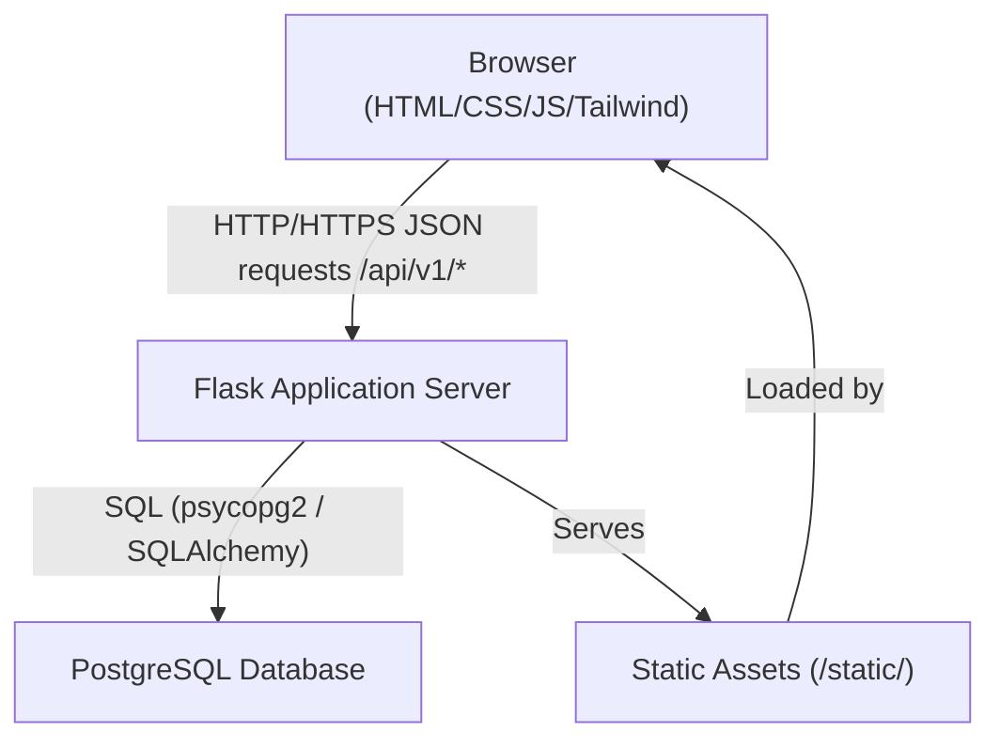
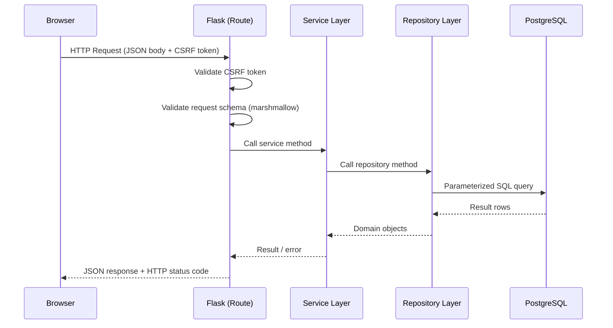
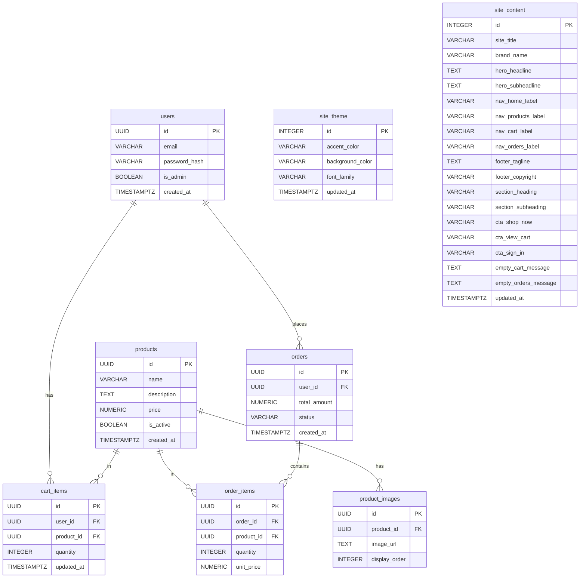

# Design Document

## Commercial E-Commerce Website

---

## Overview

This document describes the technical design for a commercial e-commerce web application. The system is built on a **Flask** backend serving a **PostgreSQL** database, with a **Tailwind CSS / vanilla JavaScript** frontend. The architecture follows a clean client-server separation: the Flask application exposes a versioned JSON REST API under `/api/v1/`, and the frontend is served as static assets from Flask's `/static/` directory.

Key design goals:
- **Visual polish**: smooth CSS animations, hover transitions, and a sliding product image gallery create an engaging shopping experience.
- **Security-first**: bcrypt password hashing, HttpOnly/Secure/SameSite cookies, CSRF tokens, and parameterized queries are non-negotiable defaults.
- **Accessibility**: WCAG 2.1 AA contrast ratios, `prefers-reduced-motion` support, and 44 × 44 px touch targets.
- **Maintainability**: a layered Flask application (routes → services → repositories) keeps business logic decoupled from HTTP concerns.

---

## Architecture

### High-Level Diagram



### Request Lifecycle



### Application Layers

| Layer | Responsibility |
|---|---|
| **Routes** (`routes/`) | HTTP binding, request parsing, response serialization |
| **Services** (`services/`) | Business logic, orchestration, error handling |
| **Repositories** (`repositories/`) | Database access, parameterized queries |
| **Models** (`models/`) | Python dataclasses / SQLAlchemy ORM models |
| **Schemas** (`schemas/`) | marshmallow schemas for request/response validation |
| **Static** (`static/`) | HTML pages, compiled Tailwind CSS, JavaScript modules |

---

## Components and Interfaces

### Backend Components

#### Auth Service (`services/auth_service.py`)

Responsible for registration, login, logout, and session management.

```python
class AuthService:
    def register(self, email: str, password: str) -> User
    def login(self, email: str, password: str) -> Session
    def logout(self, session_id: str) -> None
    def get_current_user(self, session_id: str) -> Optional[User]
```

- Passwords hashed with `bcrypt` at cost factor ≥ 12.
- Sessions stored server-side (Flask-Session with database or Redis backend).
- Login errors return a generic message — no field-level disclosure.

#### Product Service (`services/product_service.py`)

```python
class ProductService:
    def list_active_products(self) -> List[Product]
    def get_product(self, product_id: UUID) -> Product
    def get_product_images(self, product_id: UUID) -> List[ProductImage]
```

#### Admin Service (`services/admin_service.py`)

Responsible for privileged product management operations. All methods require a valid admin session (enforced at the route layer before calling into this service).

```python
class AdminService:
    def is_admin_session(self, session: dict) -> bool
    def create_product(self, name: str, price: Decimal, description: Optional[str]) -> Product
    def update_product(self, product_id: UUID, **fields) -> Product
    def delete_product(self, product_id: UUID) -> None
    def add_product_image_file(self, product_id: UUID, file_data: bytes, extension: str) -> ProductImage
    def add_product_image_url(self, product_id: UUID, image_url: str) -> ProductImage
    def remove_product_image(self, product_id: UUID, image_id: UUID) -> None
    def list_all_products(self) -> List[Product]
```

- `is_admin_session` checks `session.get("is_admin") is True`.
- All mutating methods raise `NotFoundError` if the target resource does not exist.
- `add_product_image_file` validates extension (JPG/PNG/GIF/WebP) and size (≤ 10 MB) before persisting.

#### Theme Service (`services/theme_service.py`)

Responsible for persisting and retrieving the site's active font and color palette configuration.

```python
class ThemeService:
    def get_theme(self) -> ThemeConfig
    def update_theme(self, accent_color: Optional[str], background_color: Optional[str], font_family: Optional[str]) -> ThemeConfig
    def reset_theme(self) -> ThemeConfig
```

- `update_theme` validates each hex color against the pattern `^#([0-9A-Fa-f]{6}|[0-9A-Fa-f]{3})$`; raises `ValidationError` on mismatch.
- `reset_theme` restores defaults: `accent_color="#D4AF37"`, `background_color="#0A0E1A"`, `font_family="Inter"`.
- Persistence target is the `site_theme` table (or a JSON config file in development).

#### Content Service (`services/content_service.py`)

Responsible for persisting and retrieving all editable site copy.

```python
class ContentService:
    def get_content(self) -> ContentConfig
    def update_content(self, fields: dict) -> ContentConfig
    def reset_content(self) -> ContentConfig
```

- `update_content` validates that no required field is submitted as an empty string; raises `ValidationError` listing all empty required fields.
- `reset_content` restores all fields to their original default values (see Data Models).
- Persistence target is the `site_content` table (or a JSON config file in development).

#### Order Service (`services/order_service.py`)

```python
class OrderService:
    def get_cart(self, user_id: UUID) -> List[CartItem]
    def add_to_cart(self, user_id: UUID, product_id: UUID, quantity: int) -> CartItem
    def update_cart_item(self, user_id: UUID, cart_item_id: UUID, quantity: int) -> CartItem
    def remove_from_cart(self, user_id: UUID, cart_item_id: UUID) -> None
    def place_order(self, user_id: UUID) -> Order
    def buy_now(self, user_id: UUID, product_id: UUID) -> Order
    def get_order_history(self, user_id: UUID) -> List[Order]
```

### REST API Endpoints

All endpoints are prefixed with `/api/v1/`.

#### Authentication

| Method | Path | Auth Required | Description |
|---|---|---|---|
| POST | `/api/v1/auth/register` | No | Register new user |
| POST | `/api/v1/auth/login` | No | Login, create session (sets `is_admin` flag for admin user) |
| POST | `/api/v1/auth/logout` | Yes | Invalidate session |
| GET | `/api/v1/auth/me` | Yes | Get current user info (includes `is_admin` flag) |

#### Products

| Method | Path | Auth Required | Description |
|---|---|---|---|
| GET | `/api/v1/products` | No | List all active products |
| GET | `/api/v1/products/<id>` | No | Get single product with images |

#### Cart

| Method | Path | Auth Required | Description |
|---|---|---|---|
| GET | `/api/v1/cart` | Yes | Get current cart |
| POST | `/api/v1/cart/items` | Yes | Add item to cart |
| PUT | `/api/v1/cart/items/<id>` | Yes | Update item quantity |
| DELETE | `/api/v1/cart/items/<id>` | Yes | Remove item from cart |

#### Orders

| Method | Path | Auth Required | Description |
|---|---|---|---|
| POST | `/api/v1/orders` | Yes | Place order from cart |
| POST | `/api/v1/orders/buy-now` | Yes | Buy single product immediately |
| GET | `/api/v1/orders` | Yes | Get order history |
| GET | `/api/v1/orders/<id>` | Yes | Get single order detail |

#### Admin — Product Management

All `/api/v1/admin/` endpoints return **403 Forbidden** if the session does not have `is_admin = True`.

| Method | Path | Admin Session | Description |
|---|---|---|---|
| GET | `/api/v1/admin/products` | Yes | List all products (active + inactive) |
| POST | `/api/v1/admin/products` | Yes | Create a new product |
| PUT | `/api/v1/admin/products/<id>` | Yes | Update product fields |
| DELETE | `/api/v1/admin/products/<id>` | Yes | Delete a product |
| POST | `/api/v1/admin/products/<id>/images` | Yes | Upload image file or attach image URL |
| DELETE | `/api/v1/admin/products/<id>/images/<img_id>` | Yes | Remove a product image |

#### Admin — Theme Configuration

| Method | Path | Admin Session | Description |
|---|---|---|---|
| GET | `/api/v1/admin/theme` | Yes | Retrieve active Theme_Config |
| PUT | `/api/v1/admin/theme` | Yes | Update Theme_Config (partial update supported) |
| POST | `/api/v1/admin/theme/reset` | Yes | Reset Theme_Config to defaults |

#### Admin — Content Configuration

| Method | Path | Admin Session | Description |
|---|---|---|---|
| GET | `/api/v1/admin/content` | Yes | Retrieve active Content_Config |
| PUT | `/api/v1/admin/content` | Yes | Update Content_Config fields |
| POST | `/api/v1/admin/content/reset` | Yes | Reset Content_Config to defaults |

#### Public — Theme and Content (read-only, no auth required)

| Method | Path | Auth Required | Description |
|---|---|---|---|
| GET | `/api/v1/theme` | No | Get active Theme_Config for CSS application |
| GET | `/api/v1/content` | No | Get active Content_Config for page rendering |

### Frontend Components

#### Pages

| Page | Route | Description |
|---|---|---|
| Login / Register | `/login` | Full-viewport background photo, centered card form |
| Product Listing | `/` or `/products` | Responsive grid of Product Cards |
| Cart | `/cart` | Cart items, quantity controls, totals |
| Order Confirmation | `/orders/<id>/confirmation` | Order summary after checkout |
| Order History | `/orders` | List of past orders |

#### JavaScript Modules

| Module | Responsibility |
|---|---|
| `api.js` | Fetch wrapper with CSRF token injection and error handling |
| `gallery.js` | Product image slideshow (auto-advance, manual nav, timer reset) |
| `cart.js` | Cart state management, quantity updates, total recalculation |
| `auth.js` | Login/register form submission, redirect-after-login logic |
| `notifications.js` | Slide-down toast notifications with auto-dismiss |
| `animations.js` | Intersection Observer for viewport-entry animations; respects `prefers-reduced-motion` |
| `admin.js` | Admin panel logic: tab switching, product CRUD forms, image upload, theme and content management |
| `theme.js` | Fetches active Theme_Config on page load and applies values as CSS custom properties; live-updates on admin save |
| `content.js` | Fetches active Content_Config on page load and populates all dynamic text nodes; live-updates on admin save |

#### Product Gallery Component (`gallery.js`)

```
State:
  - images: string[]          // ordered image URLs
  - currentIndex: number      // 0-based
  - timer: ReturnType<setInterval>

Behaviour:
  - init(container, images): mount DOM, start timer if images.length > 1
  - advance(): increment index (mod images.length), apply slide transition
  - goTo(index): cancel timer, set index, restart timer
  - applyTransition(): add/remove CSS classes for 500ms horizontal slide
```

#### Admin Panel Component (`admin.js`)

```
State:
  - activeTab: string         // 'products' | 'theme' | 'content'
  - editingProductId: string | null

Behaviour:
  - openAdminPanel(): show modal, activate Product_Tab by default, fetch product list
  - closeAdminPanel(): hide modal, reset state
  - switchTab(tabName): remove active class from all tab buttons and hide all panels,
                        then add active class to the selected tab button and show its panel
  - adminLoadProducts(): fetch /api/v1/admin/products, render list or empty-state
  - adminSaveProduct(): POST or PUT to admin products endpoint, refresh list on success
  - adminCancelEdit(): clear edit state, reset form
  - openImageModal(productId): show image upload modal for the given product
  - adminAddImageUrl(): POST image_url to /api/v1/admin/products/<id>/images
  - adminRemoveImage(productId, imageId): DELETE image, refresh image list
  - saveTheme(config): PUT to /api/v1/admin/theme, call theme.applyTheme() on success
  - resetTheme(): POST to /api/v1/admin/theme/reset, call theme.applyTheme() on success
  - saveContent(fields): PUT to /api/v1/admin/content, call content.applyContent() on success
  - resetContent(): POST to /api/v1/admin/content/reset, call content.applyContent() on success
```

- Tab switching is mutually exclusive: clicking any tab removes the `active` class from all other tabs and hides all other panels before activating the selected one.
- The Admin_Panel opens with `Product_Tab` active by default on every open.
- Admin-specific UI elements (the "⚙ Manage" nav link, the admin modal) are only rendered when `currentUser.is_admin === true`.

#### Theme Module (`theme.js`)

```
Behaviour:
  - loadAndApplyTheme(): GET /api/v1/theme, call applyTheme(config)
  - applyTheme(config): set CSS custom properties on :root —
      --accent-color: config.accent_color
      --bg-color: config.background_color
      --font-family: config.font_family
    Updates happen synchronously in the current document without reload.
```

- Called on every page load (DOMContentLoaded).
- Also called by `admin.js` after a successful theme save or reset to provide live preview.

#### Content Module (`content.js`)

```
Behaviour:
  - loadAndApplyContent(): GET /api/v1/content, call applyContent(config)
  - applyContent(config): iterate over all elements with a [data-content-key] attribute
      and set their textContent to config[key]; update document.title if site_title changes.
```

- Called on every page load (DOMContentLoaded).
- Also called by `admin.js` after a successful content save or reset for immediate DOM update.
- HTML elements that carry dynamic text are annotated with `data-content-key="<field_name>"` attributes.

---

## Data Models

### PostgreSQL Schema

```sql
-- Users (updated: added is_admin flag for Requirement 13)
CREATE TABLE users (
    id           UUID PRIMARY KEY DEFAULT gen_random_uuid(),
    email        VARCHAR(255) UNIQUE NOT NULL,
    password_hash VARCHAR(255) NOT NULL,
    is_admin     BOOLEAN NOT NULL DEFAULT FALSE,
    created_at   TIMESTAMPTZ NOT NULL DEFAULT NOW()
);

-- Products
CREATE TABLE products (
    id          UUID PRIMARY KEY DEFAULT gen_random_uuid(),
    name        VARCHAR(255) NOT NULL,
    description TEXT,
    price       NUMERIC(10, 2) NOT NULL CHECK (price >= 0),
    is_active   BOOLEAN NOT NULL DEFAULT TRUE,
    created_at  TIMESTAMPTZ NOT NULL DEFAULT NOW()
);

-- Product Images
CREATE TABLE product_images (
    id            UUID PRIMARY KEY DEFAULT gen_random_uuid(),
    product_id    UUID NOT NULL REFERENCES products(id) ON DELETE CASCADE,
    image_url     TEXT NOT NULL,
    display_order INTEGER NOT NULL,
    UNIQUE (product_id, display_order)
);

-- Cart Items
CREATE TABLE cart_items (
    id         UUID PRIMARY KEY DEFAULT gen_random_uuid(),
    user_id    UUID NOT NULL REFERENCES users(id) ON DELETE CASCADE,
    product_id UUID NOT NULL REFERENCES products(id) ON DELETE RESTRICT,
    quantity   INTEGER NOT NULL CHECK (quantity >= 1),
    updated_at TIMESTAMPTZ NOT NULL DEFAULT NOW(),
    UNIQUE (user_id, product_id)
);

-- Orders
CREATE TABLE orders (
    id           UUID PRIMARY KEY DEFAULT gen_random_uuid(),
    user_id      UUID NOT NULL REFERENCES users(id) ON DELETE RESTRICT,
    total_amount NUMERIC(10, 2) NOT NULL CHECK (total_amount >= 0),
    status       VARCHAR(50) NOT NULL DEFAULT 'pending',
    created_at   TIMESTAMPTZ NOT NULL DEFAULT NOW()
);

-- Order Items
CREATE TABLE order_items (
    id         UUID PRIMARY KEY DEFAULT gen_random_uuid(),
    order_id   UUID NOT NULL REFERENCES orders(id) ON DELETE CASCADE,
    product_id UUID NOT NULL REFERENCES products(id) ON DELETE RESTRICT,
    quantity   INTEGER NOT NULL CHECK (quantity >= 1),
    unit_price NUMERIC(10, 2) NOT NULL CHECK (unit_price >= 0)
);

-- Site Theme Configuration (Requirement 14)
-- Stores exactly one row (the active theme). Seeded with defaults on first run.
CREATE TABLE site_theme (
    id               INTEGER PRIMARY KEY DEFAULT 1 CHECK (id = 1),  -- singleton
    accent_color     VARCHAR(10) NOT NULL DEFAULT '#D4AF37',
    background_color VARCHAR(10) NOT NULL DEFAULT '#0A0E1A',
    font_family      VARCHAR(100) NOT NULL DEFAULT 'Inter',
    updated_at       TIMESTAMPTZ NOT NULL DEFAULT NOW()
);

-- Site Content Configuration (Requirement 16)
-- Stores exactly one row (the active content config). Seeded with defaults on first run.
CREATE TABLE site_content (
    id                    INTEGER PRIMARY KEY DEFAULT 1 CHECK (id = 1),  -- singleton
    site_title            VARCHAR(255) NOT NULL DEFAULT 'LUXE STORE',
    brand_name            VARCHAR(255) NOT NULL DEFAULT 'Luxe Store',
    hero_headline         TEXT NOT NULL DEFAULT 'Discover Luxury Redefined',
    hero_subheadline      TEXT NOT NULL DEFAULT 'Curated premium products crafted for those who appreciate the finest things in life.',
    nav_home_label        VARCHAR(100) NOT NULL DEFAULT 'Home',
    nav_products_label    VARCHAR(100) NOT NULL DEFAULT 'Products',
    nav_cart_label        VARCHAR(100) NOT NULL DEFAULT 'Cart',
    nav_orders_label      VARCHAR(100) NOT NULL DEFAULT 'Orders',
    footer_tagline        TEXT NOT NULL DEFAULT 'Premium products for discerning customers. Quality and elegance in every item.',
    footer_copyright      VARCHAR(255) NOT NULL DEFAULT '© 2024 LUXE STORE. All rights reserved.',
    section_heading       VARCHAR(255) NOT NULL DEFAULT 'Our Collection',
    section_subheading    VARCHAR(255) NOT NULL DEFAULT 'Handpicked premium items',
    cta_shop_now          VARCHAR(100) NOT NULL DEFAULT 'Shop Now',
    cta_view_cart         VARCHAR(100) NOT NULL DEFAULT 'View Cart',
    cta_sign_in           VARCHAR(100) NOT NULL DEFAULT 'Sign In',
    empty_cart_message    TEXT NOT NULL DEFAULT 'Your cart is empty.',
    empty_orders_message  TEXT NOT NULL DEFAULT 'No orders yet.',
    updated_at            TIMESTAMPTZ NOT NULL DEFAULT NOW()
);
```

### Python Domain Models

```python
@dataclass
class User:
    id: UUID
    email: str
    password_hash: str
    is_admin: bool
    created_at: datetime

@dataclass
class Product:
    id: UUID
    name: str
    description: Optional[str]
    price: Decimal
    is_active: bool
    created_at: datetime
    images: List[ProductImage] = field(default_factory=list)

@dataclass
class ProductImage:
    id: UUID
    product_id: UUID
    image_url: str
    display_order: int

@dataclass
class CartItem:
    id: UUID
    user_id: UUID
    product_id: UUID
    quantity: int
    updated_at: datetime
    product: Optional[Product] = None  # joined for display

@dataclass
class Order:
    id: UUID
    user_id: UUID
    total_amount: Decimal
    status: str
    created_at: datetime
    items: List[OrderItem] = field(default_factory=list)

@dataclass
class OrderItem:
    id: UUID
    order_id: UUID
    product_id: UUID
    quantity: int
    unit_price: Decimal

@dataclass
class ThemeConfig:
    accent_color: str       # hex, e.g. "#D4AF37"
    background_color: str   # hex, e.g. "#0A0E1A"
    font_family: str        # e.g. "Inter"
    updated_at: datetime

@dataclass
class ContentConfig:
    site_title: str
    brand_name: str
    hero_headline: str
    hero_subheadline: str
    nav_home_label: str
    nav_products_label: str
    nav_cart_label: str
    nav_orders_label: str
    footer_tagline: str
    footer_copyright: str
    section_heading: str
    section_subheading: str
    cta_shop_now: str
    cta_view_cart: str
    cta_sign_in: str
    empty_cart_message: str
    empty_orders_message: str
    updated_at: datetime
```

### Entity Relationship Diagram



---

## Correctness Properties

*A property is a characteristic or behavior that should hold true across all valid executions of a system — essentially, a formal statement about what the system should do. Properties serve as the bridge between human-readable specifications and machine-verifiable correctness guarantees.*

Property-based testing (PBT) is applicable here because the system contains pure functions and service-layer logic (password hashing, price formatting, cart total calculation, order creation, gallery state machine, input validation) where behavior varies meaningfully with input and 100+ iterations will surface edge cases that a handful of examples would miss. The PBT library chosen is **Hypothesis** (Python) for backend properties and **fast-check** (JavaScript) for frontend/gallery properties.

---

### Property 1: Password hashing uses bcrypt with cost factor ≥ 12

*For any* password string, the Auth_Service's hash function SHALL produce a bcrypt hash whose embedded cost factor is greater than or equal to 12.

**Validates: Requirements 1.1**

---

### Property 2: Registration with valid credentials creates a retrievable user

*For any* syntactically valid email address and password of length ≥ 8, calling `register()` SHALL result in a user record existing in the system with that email, and the stored password hash SHALL verify correctly against the original password.

**Validates: Requirements 1.2**

---

### Property 3: Duplicate email registration is rejected with 409

*For any* email that has already been successfully registered, a subsequent registration attempt with the same email SHALL return a 409 Conflict response, regardless of the password provided.

**Validates: Requirements 1.3**

---

### Property 4: Login/logout session round-trip

*For any* registered user, logging in with correct credentials SHALL create a valid session (subsequent authenticated requests succeed), and after logout that same session SHALL be invalid (subsequent authenticated requests return 401).

**Validates: Requirements 1.4, 1.6**

---

### Property 5: Invalid credentials always return a generic 401

*For any* combination of (email, password) where either the email is not registered or the password does not match the stored hash, the login endpoint SHALL return a 401 Unauthorized response whose body does not indicate which field (email or password) was incorrect.

**Validates: Requirements 1.5**

---

### Property 6: Product listing returns only active products

*For any* database state containing a mix of active and inactive products, the `list_active_products()` service method SHALL return exactly the products where `is_active = true` and SHALL NOT include any product where `is_active = false`.

**Validates: Requirements 3.1**

---

### Property 7: Price formatting always produces exactly two decimal places with currency symbol

*For any* non-negative numeric price value, the frontend price formatting function SHALL produce a string that matches the pattern `<currency_symbol><integer_part>.<two_digit_decimal>` (e.g., `$12.00`, `$0.99`, `$1234.50`).

**Validates: Requirements 3.4, 6.5**

---

### Property 8: Gallery timer is active if and only if there is more than one image

*For any* product gallery initialized with a list of images, the auto-advance timer SHALL be active (interval set to 15 000 ms) if and only if the image list contains more than one image. For a single-image gallery, no timer SHALL be started and no navigation controls SHALL be rendered.

**Validates: Requirements 4.2, 4.7**

---

### Property 9: Gallery circular navigation wraps correctly

*For any* gallery with N > 1 images, advancing from the image at index N − 1 SHALL result in the current index becoming 0, and advancing from any index i (0 ≤ i < N − 1) SHALL result in index i + 1.

**Validates: Requirements 4.4**

---

### Property 10: Manual gallery navigation resets the auto-advance timer

*For any* gallery state and any target image index, calling `goTo(index)` SHALL cancel the existing auto-advance timer and start a fresh 15-second timer, so that the next automatic advance occurs exactly 15 seconds after the manual selection.

**Validates: Requirements 4.6**

---

### Property 11: All four action buttons are rendered on every product card

*For any* product object, the rendered Product_Card HTML SHALL contain exactly four action buttons with labels "Buy", "Add to Cart", "Product Info", and "Shipping Location".

**Validates: Requirements 5.1**

---

### Property 12: Buy-now creates an order with the correct product at quantity 1

*For any* authenticated user and any active product, calling `buy_now(user_id, product_id)` SHALL create an Order record containing exactly one OrderItem for that product with `quantity = 1` and `unit_price` equal to the product's current price, and the Order's `total_amount` SHALL equal the product's price.

**Validates: Requirements 5.2**

---

### Property 13: Cart items persist across sessions

*For any* authenticated user and any set of products added to the cart, after the session is ended and a new session is started (re-login), `get_cart(user_id)` SHALL return all previously added items with their correct quantities.

**Validates: Requirements 5.3, 6.1**

---

### Property 14: Removing a cart item is reflected immediately

*For any* cart containing at least one item, calling `remove_from_cart(user_id, cart_item_id)` SHALL result in `get_cart(user_id)` no longer containing an item with that `cart_item_id`.

**Validates: Requirements 6.4**

---

### Property 15: Cart total equals the sum of (unit_price × quantity) for all items

*For any* collection of cart items, each with a unit price and a positive integer quantity, the computed cart total SHALL equal `Σ (unit_price_i × quantity_i)` for all items i, formatted to two decimal places.

**Validates: Requirements 6.3, 6.5**

---

### Property 16: Order total equals the sum of order item (unit_price × quantity)

*For any* order created from a non-empty cart, the Order's `total_amount` SHALL equal `Σ (unit_price_i × quantity_i)` for all OrderItems in that order.

**Validates: Requirements 7.1**

---

### Property 17: Order history is sorted by creation timestamp in descending order

*For any* user with two or more orders, `get_order_history(user_id)` SHALL return the orders such that for every consecutive pair (orders[i], orders[i+1]), `orders[i].created_at >= orders[i+1].created_at`.

**Validates: Requirements 7.3**

---

### Property 18: prefers-reduced-motion disables non-essential animations

*For any* animated element in the frontend, when the `prefers-reduced-motion: reduce` media query is active, the element SHALL NOT have CSS `transition`, `animation`, or `transform` properties applied that produce motion (durations should be 0ms or the properties should be absent).

**Validates: Requirements 8.4**

---

### Property 19: Confirmation notifications auto-dismiss after 3 seconds

*For any* notification displayed by the notification system, the notification element SHALL be removed from the DOM (or have its visibility set to hidden) within 3 500 ms of being shown (allowing 500 ms tolerance for the fade-out animation).

**Validates: Requirements 8.5**

---

### Property 20: All API routes are under the /api/v1/ prefix

*For any* route registered in the Flask application that handles data operations (auth, products, cart, orders), the URL rule SHALL begin with `/api/v1/`.

**Validates: Requirements 9.1**

---

### Property 21: Malformed JSON bodies return 400 with an error message

*For any* POST or PUT endpoint and any string that is not valid JSON, sending that string as the request body SHALL return a 400 Bad Request response whose JSON body contains a non-empty `error` or `message` field.

**Validates: Requirements 9.3**

---

### Property 22: Schema validation returns 400 listing all violated constraints

*For any* request body that violates one or more schema constraints (missing required fields, wrong types, out-of-range values), the endpoint SHALL return a 400 response whose body lists every violated constraint — not just the first one.

**Validates: Requirements 9.4**

---

### Property 23: State-changing requests without a valid CSRF token are rejected

*For any* POST, PUT, or DELETE endpoint, a request that omits or provides an invalid CSRF token SHALL receive a 403 Forbidden response, regardless of whether the session is otherwise valid.

**Validates: Requirements 11.3**

---

### Property 24: SQL injection payloads are treated as literal data

*For any* user-supplied string input containing SQL metacharacters or injection patterns (e.g., `'; DROP TABLE users; --`, `1 OR 1=1`), the system SHALL store or process the string as literal text and SHALL NOT execute any unintended SQL statements.

**Validates: Requirements 11.4**

---

### Property 25: Text contrast ratio meets WCAG 2.1 AA (≥ 4.5:1)

*For any* text element in the design system and its associated background color, the computed WCAG contrast ratio SHALL be greater than or equal to 4.5:1.

**Validates: Requirements 12.3**

---

### Property 26: Interactive elements meet minimum touch target size on mobile

*For any* interactive element (button, link, form input) rendered at a mobile viewport width (< 640px), the element's computed width and height SHALL each be at least 44 CSS pixels.

**Validates: Requirements 12.4**

---

### Property 27: All `/api/v1/admin/` endpoints return 403 without a valid admin session

*For any* HTTP request to any endpoint under `/api/v1/admin/` — regardless of HTTP method — made without a session that has `is_admin = True`, the Backend SHALL return a 403 Forbidden response. This applies equally to unauthenticated requests, requests with a valid non-admin session, and requests with an expired session.

**Validates: Requirements 13.3, 13.6**

---

### Property 28: Valid product creation round-trip via Admin_Service

*For any* combination of a non-empty product name, a non-negative price, and an optional description, calling `Admin_Service.create_product()` SHALL result in a product record that is retrievable via `Admin_Service.list_all_products()` with the same name, price, and description values.

**Validates: Requirements 13.9**

---

### Property 29: Invalid product form data is rejected with a 400 response

*For any* product creation or update request where the name is empty/blank OR the price is negative or non-numeric, the `/api/v1/admin/products` endpoint SHALL return a 400 Bad Request response with a descriptive error message, and no product record SHALL be created or modified.

**Validates: Requirements 13.11**

---

### Property 30: Theme_Config persistence round-trip

*For any* valid Theme_Config update (valid hex accent color, valid hex background color, valid font family name), calling `Theme_Service.update_theme()` followed by `Theme_Service.get_theme()` SHALL return a ThemeConfig whose `accent_color`, `background_color`, and `font_family` fields exactly match the submitted values.

**Validates: Requirements 14.2**

---

### Property 31: CSS custom properties reflect the active Theme_Config on page load

*For any* stored Theme_Config, when a page is loaded, the CSS custom properties `--accent-color`, `--bg-color`, and `--font-family` on the `:root` element SHALL equal the `accent_color`, `background_color`, and `font_family` values returned by `GET /api/v1/theme`.

**Validates: Requirements 14.3**

---

### Property 32: Invalid hex color values are rejected by Theme_Service

*For any* string that does not match the pattern `^#([0-9A-Fa-f]{6}|[0-9A-Fa-f]{3})$`, submitting it as an `accent_color` or `background_color` in a Theme_Config update SHALL cause the Theme_Service to return a validation error and leave the stored Theme_Config unchanged.

**Validates: Requirements 14.7**

---

### Property 33: Admin_Panel tab switching is mutually exclusive

*For any* tab click within the Admin_Panel, exactly one tab button SHALL have the active CSS class and its corresponding panel SHALL be visible, while all other tab buttons SHALL not have the active class and their panels SHALL be hidden.

**Validates: Requirements 15.1, 15.2**

---

### Property 34: Product list panel reflects the current backend product state

*For any* set of products in the backend (including the empty set), when the product list panel is visible in the Admin_Panel, the rendered list SHALL contain exactly the products returned by `GET /api/v1/admin/products`, or display an empty-state message if the list is empty.

**Validates: Requirements 15.4**

---

### Property 35: Content_Config persistence round-trip

*For any* valid Content_Config update (all required fields non-empty), calling `Content_Service.update_content()` followed by `Content_Service.get_content()` SHALL return a ContentConfig whose fields exactly match the submitted values.

**Validates: Requirements 16.3**

---

### Property 36: Empty required content fields are rejected

*For any* Content_Config update request where one or more required fields are submitted as empty strings, the `PUT /api/v1/admin/content` endpoint SHALL return a 400 Bad Request response listing all empty required fields, and the stored Content_Config SHALL remain unchanged.

**Validates: Requirements 16.6**

---

### Property 37: Rendered page text reflects the active Content_Config

*For any* stored Content_Config, when a page is loaded and `content.js` applies the config, every DOM element annotated with a `data-content-key` attribute SHALL have its `textContent` set to the corresponding field value from the Content_Config returned by `GET /api/v1/content`.

**Validates: Requirements 16.2**

---

## Error Handling

### HTTP Error Response Format

All API errors return a consistent JSON envelope:

```json
{
  "error": {
    "code": "VALIDATION_ERROR",
    "message": "Human-readable description",
    "details": ["field: constraint violated", "..."],
    "trace_id": "uuid-v4-string"
  }
}
```

- `code`: machine-readable error code (e.g., `VALIDATION_ERROR`, `UNAUTHORIZED`, `NOT_FOUND`, `CONFLICT`, `INTERNAL_ERROR`)
- `message`: safe, user-facing description — never exposes stack traces or internal details
- `details`: array of field-level messages (populated for 400 validation errors)
- `trace_id`: UUID generated per request, logged server-side for correlation

### Error Scenarios by Layer

#### Authentication Errors

| Scenario | HTTP Status | Code |
|---|---|---|
| Invalid credentials | 401 | `UNAUTHORIZED` |
| Session expired / missing | 401 | `SESSION_EXPIRED` |
| CSRF token missing/invalid | 403 | `CSRF_INVALID` |
| Email already registered | 409 | `EMAIL_CONFLICT` |
| Admin endpoint without admin session | 403 | `FORBIDDEN` |

#### Validation Errors

| Scenario | HTTP Status | Code |
|---|---|---|
| Malformed JSON body | 400 | `MALFORMED_REQUEST` |
| Schema validation failure | 400 | `VALIDATION_ERROR` |
| Password too short (< 8 chars) | 400 | `VALIDATION_ERROR` |
| Invalid email format | 400 | `VALIDATION_ERROR` |
| Cart quantity < 1 | 400 | `VALIDATION_ERROR` |
| Product name empty | 400 | `VALIDATION_ERROR` |
| Product price negative or non-numeric | 400 | `VALIDATION_ERROR` |
| Invalid hex color in Theme_Config | 400 | `VALIDATION_ERROR` |
| Required content field empty | 400 | `VALIDATION_ERROR` |
| Image file type not allowed | 400 | `VALIDATION_ERROR` |
| Image file exceeds 10 MB | 400 | `VALIDATION_ERROR` |

#### Resource Errors

| Scenario | HTTP Status | Code |
|---|---|---|
| Product not found | 404 | `NOT_FOUND` |
| Cart item not found | 404 | `NOT_FOUND` |
| Order not found | 404 | `NOT_FOUND` |

#### Server Errors

| Scenario | HTTP Status | Code |
|---|---|---|
| Database connection failure | 500 | `INTERNAL_ERROR` |
| Unexpected exception | 500 | `INTERNAL_ERROR` |

All 500 errors are logged with the `trace_id`, full stack trace, and request context. The response body contains only the `trace_id` and a generic message.

### Frontend Error Handling

- Network errors (fetch failures): display a toast notification with a retry option.
- 401 responses on protected pages: redirect to `/login` with `?return_to=<current_path>`.
- 403 CSRF errors: refresh the CSRF token and retry the request once automatically.
- 404 responses: display an inline "not found" message within the relevant component.
- 500 responses: display a user-friendly error toast with the `trace_id` for support reference.

### Gallery Error Handling

- If an image fails to load (`onerror`): display a placeholder image and continue the slideshow.
- If the images array is empty: display a static placeholder image; no gallery controls are rendered.

---

## Testing Strategy

### Overview

The testing strategy uses a **dual approach**: property-based tests for universal correctness guarantees and example-based unit/integration tests for specific scenarios, edge cases, and infrastructure wiring.

### Backend Testing (Python / Hypothesis)

**Framework**: `pytest` + `Hypothesis` for property-based tests, `pytest` alone for unit/integration tests.

**Property-Based Tests** (minimum 100 iterations each):

Each property test is tagged with a comment referencing the design property:
```python
# Feature: commercial-ecommerce-website, Property 1: Password hashing uses bcrypt with cost factor >= 12
@given(st.text(min_size=8))
def test_password_hash_cost_factor(password):
    hashed = auth_service.hash_password(password)
    assert bcrypt.checkpw(password.encode(), hashed)
    assert bcrypt.gensalt(rounds=12)  # verify cost factor
```

Properties to implement as PBT:
- **Property 1**: `@given(st.text(min_size=1))` — verify bcrypt cost ≥ 12
- **Property 2**: `@given(valid_email(), st.text(min_size=8))` — register then retrieve user
- **Property 3**: `@given(valid_email(), st.text(min_size=8))` — duplicate registration → 409
- **Property 4**: `@given(registered_user())` — login/logout round-trip
- **Property 5**: `@given(invalid_credentials())` — always 401, generic message
- **Property 6**: `@given(st.lists(product_strategy()))` — only active products returned
- **Property 7**: `@given(st.decimals(min_value=0, max_value=99999, places=2))` — price format
- **Property 12**: `@given(registered_user(), active_product())` — buy-now order correctness
- **Property 13**: `@given(registered_user(), st.lists(active_product(), min_size=1))` — cart persistence
- **Property 14**: `@given(cart_with_items())` — remove item not in cart
- **Property 15**: `@given(st.lists(cart_item_strategy(), min_size=1))` — cart total = Σ(price × qty)
- **Property 16**: `@given(cart_with_items())` — order total = Σ(unit_price × qty)
- **Property 17**: `@given(st.lists(order_strategy(), min_size=2))` — order history sorted desc
- **Property 21**: `@given(st.text())` — malformed JSON → 400
- **Property 22**: `@given(invalid_request_body())` — schema errors list all violations
- **Property 23**: `@given(state_changing_endpoint(), valid_session())` — no CSRF → 403
- **Property 24**: `@given(sql_injection_payload())` — injection treated as literal data
- **Property 27**: `@given(admin_endpoint_path(), st.one_of(no_session(), non_admin_session()))` — all `/api/v1/admin/` endpoints return 403 without admin session
- **Property 28**: `@given(st.text(min_size=1), st.decimals(min_value=0, max_value=99999, places=2), st.one_of(st.none(), st.text()))` — valid product creation round-trip
- **Property 29**: `@given(invalid_product_data())` — invalid product form data returns 400
- **Property 30**: `@given(valid_hex_color(), valid_hex_color(), st.text(min_size=1))` — Theme_Config persistence round-trip
- **Property 32**: `@given(invalid_hex_string())` — invalid hex color rejected by Theme_Service
- **Property 35**: `@given(valid_content_config())` — Content_Config persistence round-trip
- **Property 36**: `@given(content_config_with_empty_required_field())` — empty required content fields rejected

**Example-Based Unit Tests**:
- Auth: registration with exactly 8-char password, registration with 7-char password (rejected), login with correct/incorrect credentials
- Admin auth: login with admin credentials sets `is_admin=True` in session; login with non-admin credentials does not
- Admin panel: admin-specific nav element hidden for unauthenticated users and regular customers
- Theme: `reset_theme()` returns `{accent_color: '#D4AF37', background_color: '#0A0E1A', font_family: 'Inter'}`
- Content: `reset_content()` returns all default field values
- Cart: empty cart message, quantity update recalculates total
- Orders: order confirmation page content, order history empty state
- Error handling: database error during order creation returns 500 with trace ID (mocked DB)
- Security: session cookie attributes (HttpOnly, Secure, SameSite=Strict)
- API: 404 for unknown product ID, 401 for unauthenticated cart access

**Integration Tests**:
- Full registration → login → add to cart → checkout flow against a test PostgreSQL database
- Referential integrity: attempt to delete a user with active cart items (expect constraint error)
- Session persistence across requests
- Admin login flow: login with admin credentials → verify `is_admin` in session → access admin endpoint → verify 200
- Non-admin access: login with regular credentials → attempt admin endpoint → verify 403
- Theme persistence: update theme via admin endpoint → load public theme endpoint → verify values match
- Content persistence: update content via admin endpoint → load public content endpoint → verify values match

### Frontend Testing (JavaScript / fast-check)

**Framework**: `vitest` + `fast-check` for property-based tests, `vitest` alone for unit tests.

**Property-Based Tests**:
- **Property 7**: `fc.float({ min: 0 })` — price formatting always produces 2 decimal places
- **Property 8**: `fc.array(fc.string(), { minLength: 0, maxLength: 10 })` — gallery timer init
- **Property 9**: `fc.array(fc.string(), { minLength: 2 })` — circular navigation wraps
- **Property 10**: `fc.array(fc.string(), { minLength: 2 }), fc.nat()` — manual nav resets timer
- **Property 11**: `fc.record({ id: fc.uuid(), name: fc.string(), price: fc.float() })` — four buttons rendered
- **Property 18**: `fc.boolean()` — prefers-reduced-motion disables animations
- **Property 19**: `fc.string()` — notification dismissed within 3 500 ms
- **Property 25**: `fc.record({ text: fc.hexaString(6, 6), bg: fc.hexaString(6, 6) })` — contrast ≥ 4.5:1
- **Property 26**: `fc.record({ type: fc.constantFrom('button', 'a', 'input') })` — touch target ≥ 44px
- **Property 31**: `fc.record({ accent_color: validHex(), background_color: validHex(), font_family: fc.string({ minLength: 1 }) })` — CSS custom properties reflect active Theme_Config
- **Property 33**: `fc.constantFrom('products', 'theme', 'content')` — tab switching is mutually exclusive
- **Property 34**: `fc.array(productRecord(), { minLength: 0, maxLength: 20 })` — product list panel reflects backend state
- **Property 37**: `fc.record(contentConfigArbitrary())` — rendered page text reflects active Content_Config

**Example-Based Unit Tests**:
- Gallery: single-image product shows no nav controls, no timer
- Cart: empty cart renders empty-state message and CTA link
- Auth guard: clicking "Add to Cart" while unauthenticated redirects to `/login?return_to=...`
- Notifications: slide-down animation class applied on show
- Responsive: hamburger menu rendered at < 640px viewport
- Admin panel: opens with Product_Tab active by default; admin nav element hidden for non-admin users
- Theme live update: saving theme config updates CSS custom properties without page reload
- Content live update: saving content config updates DOM text nodes without page reload
- Product list error: failed fetch shows inline error message and retry button
- Admin_Panel default open: Product_Tab is active and product list is visible on first open

**Smoke / Visual Tests** (manual or Playwright):
- Login page: full-viewport background, centered card, brand name visible
- Product grid: 1 column at 320px, 4 columns at 1280px
- Hover transitions: 150–300ms on buttons, links, cards
- Hamburger menu: collapses/expands at 640px breakpoint
- HTTPS redirect in production
- Admin account: `is_admin` flag present in `users` table; admin credentials loaded from env vars
- Theme_Config schema: `site_theme` table contains `accent_color`, `background_color`, `font_family` columns
- Content_Config schema: `site_content` table contains all required content fields

### Test Configuration

```python
# conftest.py (Hypothesis settings)
from hypothesis import settings, HealthCheck

settings.register_profile("ci", max_examples=200, suppress_health_check=[HealthCheck.too_slow])
settings.register_profile("dev", max_examples=50)
settings.load_profile("ci")
```

```javascript
// vitest.config.js (fast-check)
// Each property test runs with numRuns: 100 minimum
import { defineConfig } from 'vitest/config'
export default defineConfig({
  test: { globals: true }
})
```

### Coverage Targets

| Layer | Target |
|---|---|
| Service layer (Python) | ≥ 90% line coverage |
| Repository layer (Python) | ≥ 85% line coverage |
| JavaScript modules | ≥ 80% line coverage |
| Property tests | All 37 properties implemented |
